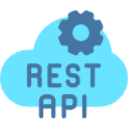

  <h3>Hi there 👋, Meet yingtu35!</h3>

Hello👋 My name is Ying Tu. I am a computer science graduate student at University of Southern California. Fight On! ✊  
I am a software engineer who is passionate about building real-world projects and solving real-world problems.  
I enjoy coding and problem solving, and my skills build around web🖥, mobile📱 development, and cloud computing.  
I previously worked as a software engineer intern at <a href="https://www.appier.com/en/">Appier</a> and <a href="https://www.gbcsgroup.com/">GBCS Group</a>. 
I am currently looking for internship opportunities in software engineering, web development, and cloud computing.   If you are interested in my profile, please feel free to reach out to me!  

  My current tech stack includes:
  - Programming Languages: , , , , 
  - Web and mobile frameworks: , , , , , , , , 
  - Database: , , 
  - Tools: , , , , , 
  - Cloud Services: 

Here are some ideas to get you started:

- 🔭 I’m currently working on refining the Gmail Cleaning Scheduler project!
- 🌱 Brainstorming a new AI project...
- 🤔 I’m looking for internship opportunities😂
- 💬 Ask me about everything about me!
- 📫 How to reach me: check out my social media link below
- 😄 Pronouns: He/Him
- ⚡ Fun fact: In Chinese, Tu Ying sounds exactly like "doing"😂😂😂

   
  
  
  
  
  
  
  

<!-- - 👯 I’m looking to collaborate on  --!>

